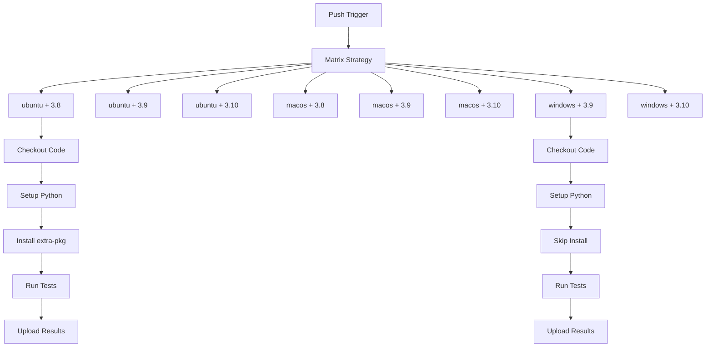

# GitHub Actions: Running a Job Multiple Times Using a Matrix

## Matrix Strategy

The matrix strategy lets you run a job multiple times with different combinations of variables. This is useful for testing across multiple operating systems, language versions, or other configurations.


## ✅ What is a Matrix Strategy in GitHub Actions?

Matrix allows you to run a job **multiple times in parallel**, varying parameters like:

* OS
* Environment (dev/staging/prod)
* Versions (Java, Python, etc.)

This is great for:

* Testing across multiple environments
* Deploying to multiple regions
* Running the same logic against multiple configs

---

## 🧪 Real-World Example: Deploy to Multiple Environments

Imagine you want to **run a shell-based deploy job to 3 environments** — `dev`, `staging`, and `prod`.

```yaml
name: Multi-Env Deployment using Matrix

on:
  workflow_dispatch:

jobs:
  deploy:
    runs-on: ubuntu-latest

    strategy:
      matrix:
        environment: [dev, staging, prod]

    steps:
      - name: Checkout Code
        uses: actions/checkout@v4

      - name: Deploy to ${{ matrix.environment }}
        run: |
          echo "Starting deployment to ${{ matrix.environment }} environment"
          sleep 3
          echo "Deployment to ${{ matrix.environment }} completed successfully"
```

---

### 🧾 Explanation:

* `matrix.environment` creates **3 parallel jobs**:
  one each for `dev`, `staging`, and `prod`.
* Each job will run the same steps, but with its **own value of `matrix.environment`**.
* You can customize steps per environment if needed using `if:` conditionals.

---

### ✅ Output:

You will see:

* One job for `dev`
* One job for `staging`
* One job for `prod`
  All running **independently and in parallel**.

---

## Complete Example (Non-NPM)

Here's a practical example testing a Python script across different operating systems and Python versions:

```yaml
name: Multi-Platform Python Tests

on: [push]

jobs:
  test:
    runs-on: ${{ matrix.os }}
    strategy:
      matrix:
        os: [ubuntu-latest, macos-latest, windows-latest]
        python-version: ["3.8", "3.9", "3.10"]
        include:
          - os: ubuntu-latest
            extra-pkg: "python3-dev"
          - os: macos-latest
            extra-pkg: "openssl"
          - os: windows-latest
            extra-pkg: "python"
        exclude:
          - os: windows-latest
            python-version: "3.8"  # Don't test Python 3.8 on Windows
    
    steps:
    - name: Checkout code
      uses: actions/checkout@v4
      
    - name: Set up Python ${{ matrix.python-version }}
      uses: actions/setup-python@v4
      with:
        python-version: ${{ matrix.python-version }}
        
    - name: Install system dependencies
      if: runner.os != 'Windows'  # Skip on Windows
      run: |
        sudo apt-get update
        sudo apt-get install -y ${{ matrix.extra-pkg }}
        
    - name: Run tests
      run: |
        python -m pip install pytest
        python -m pytest tests/
        
    - name: Upload test results
      uses: actions/upload-artifact@v3
      if: always()  # Upload even if tests fail
      with:
        name: test-results-${{ matrix.os }}-py${{ matrix.python-version }}
        path: test-reports/
```

#### Let's walk through the **step-by-step flow and execution logic** of this GitHub Actions matrix workflow — **visually and descriptively**.

---

## 🔁 Trigger

### ✅ **When does it run?**

```yaml
on: [push]
```

* Runs **automatically whenever someone pushes code** to any branch in the repo.

---

## 🔄 Matrix Breakdown

### 🧮 **Matrix Inputs:**

```yaml
os: [ubuntu-latest, macos-latest, windows-latest]
python-version: ["3.8", "3.9", "3.10"]
```

This results in 3 × 3 = 9 jobs **before filtering**.

---

### 🔍 Matrix `include` (adds extra data):

```yaml
include:
  - os: ubuntu-latest     ➡ extra-pkg: python3-dev
  - os: macos-latest      ➡ extra-pkg: openssl
  - os: windows-latest    ➡ extra-pkg: python
```

Each job gets an **`extra-pkg`** value based on its OS.

---

### ❌ Matrix `exclude` (removes one case):

```yaml
exclude:
  - os: windows-latest
    python-version: "3.8"
```

Now only 8 jobs run (1 excluded).

---

## 📊 FINAL MATRIX JOBS (8 total):

| OS             | Python Version | Extra Package |
| -------------- | -------------- | ------------- |
| ubuntu-latest  | 3.8            | python3-dev   |
| ubuntu-latest  | 3.9            | python3-dev   |
| ubuntu-latest  | 3.10           | python3-dev   |
| macos-latest   | 3.8            | openssl       |
| macos-latest   | 3.9            | openssl       |
| macos-latest   | 3.10           | openssl       |
| windows-latest | 3.9            | python        |
| windows-latest | 3.10           | python        |

---

## 🧭 Flow Diagram of Execution

```text
Trigger: push
   │
   └──► Starts job: test (matrix strategy)
             │
             ├──► ubuntu-latest + 3.8 + python3-dev
             ├──► ubuntu-latest + 3.9 + python3-dev
             ├──► ubuntu-latest + 3.10 + python3-dev
             ├──► macos-latest + 3.8 + openssl
             ├──► macos-latest + 3.9 + openssl
             ├──► macos-latest + 3.10 + openssl
             ├──► windows-latest + 3.9 + python
             └──► windows-latest + 3.10 + python
```

Each job runs **independently and in parallel** (unless you define `needs:`).

---

## 🧱 Step-by-Step Execution *within each matrix job*

### Step 1: ✅ Checkout Code

```yaml
- uses: actions/checkout@v4
```

Pulls your repo code onto the runner machine.

---

### Step 2: ☕ Set Up Python

```yaml
- uses: actions/setup-python@v4
  with:
    python-version: ${{ matrix.python-version }}
```

Sets the Python version for that job (3.8 / 3.9 / 3.10).

---

### Step 3: 🔧 Install System Packages (only if not Windows)

```yaml
- run: sudo apt-get install -y ${{ matrix.extra-pkg }}
  if: runner.os != 'Windows'
```

* Linux/macOS: installs required system dependencies.
* Windows: **skips this step**.

---

### Step 4: 🧪 Run Tests

```yaml
- run: |
    python -m pip install pytest
    python -m pytest tests/
```

* Installs `pytest`
* Executes tests in the `tests/` directory.

---

### Step 5: 📦 Upload Artifacts (even if tests fail)

```yaml
- uses: actions/upload-artifact@v3
  if: always()
  with:
    name: test-results-${{ matrix.os }}-py${{ matrix.python-version }}
    path: test-reports/
```

* Uploads test results even if the test fails.
* Artifact is named using OS + Python version for clarity.

---

## 🧭 Visual Summary



---


## Key Components:

1. **Matrix Definition**:
   - `os`: Tests run on Ubuntu, macOS, and Windows
   - `python-version`: Tests with Python 3.8, 3.9, and 3.10
   - `include`: Adds extra variables specific to each OS
   - `exclude`: Skips Python 3.8 tests on Windows

2. **Job Execution**:
   - This creates 8 jobs (3 OS × 3 Python versions, minus 1 excluded combination)
   - Each job gets its combination of `os`, `python-version`, and `extra-pkg`

3. **Accessing Matrix Values**:
   - Use `${{ matrix.variable-name }}` to access matrix values in steps
   - Example: `${{ matrix.os }}` and `${{ matrix.python-version }}`

## Advanced Matrix Features:

1. **Dynamic Matrices** (from outputs):
```yaml
strategy:
  matrix:
    version: ${{ fromJSON(needs.setup.outputs.versions) }}
```

2. **Fail Fast**:
```yaml
strategy:
  fail-fast: true  # Stop all jobs if one fails (default)
  # or false to continue other jobs if one fails
```

## Official Documentation References:

- [Using a matrix for your jobs](https://docs.github.com/en/actions/using-jobs/using-a-matrix-for-your-jobs)
- [Workflow syntax for jobs.<job_id>.strategy.matrix](https://docs.github.com/en/actions/using-workflows/workflow-syntax-for-github-actions#jobsjob_idstrategymatrix)

This example demonstrates matrix usage for cross-platform testing without npm, showing how to test Python code across different operating systems and language versions while handling platform-specific requirements.

####  Let's clarify how the *matrix strategy* works in GitHub Actions, especially in the context of using *different Node.js versions* in the same workflow.

---

### 💡 Your Matrix Strategy

yaml
jobs:
  node-matrix:
    runs-on: ubuntu-latest
    strategy:
      matrix:
        node-version: [14, 15, 16]
    steps:
      - run: node -v
      - uses: actions/setup-node@v3
        with:
          node-version: ${{ matrix.node-version }}
      - run: node -v


---

### ❓Does Each Job Run on the Same or Different Runners?

*Each matrix job runs on a separate runner instance.*

* *GitHub creates a new virtual machine (runner)* for each combination defined in your matrix.
* That means:

  * Job with Node.js 14 runs on *VM 1*
  * Job with Node.js 15 runs on *VM 2*
  * Job with Node.js 16 runs on *VM 3*

---

### ✅ Why This Works

You are correct that you *can’t install multiple Node.js versions on the same environment at once* without overriding or managing them manually (e.g., with nvm). 

But GitHub Actions avoids that problem by *spinning up a fresh environment per matrix entry*.

* Each job *starts clean* with its own OS instance.
* There’s *no interference or overwrite*, even if all jobs use the same runs-on: ubuntu-latest.

---

### 🔁 Flow (Simplified)

1. *Matrix expansion*: GitHub generates 3 jobs:

   * node-version: 14
   * node-version: 15
   * node-version: 16

2. *Each job*:

   * Gets a fresh Ubuntu VM.
   * Installs the specified Node.js version via actions/setup-node@v3.
   * Runs the commands you defined.

---

### 🧠 Summary

* ✅ Each matrix combination runs in a *separate GitHub-hosted runner*.
* ✅ You *can safely use different Node.js versions* without conflict.
* ❌ The jobs do *not* run in the same runner, so there is *no version overwrite* issue.

Let me know if you'd like a diagram showing this visually.

## 🧷 Real-World Use Cases:

* Testing an Ansible playbook across multiple OSes.
* Running Terraform plan against different workspaces.
* Validating Bash scripts with multiple input parameters.

---

Great question, Deepak! GitHub Actions' `strategy` supports multiple parameters to control **matrix job behavior** like **concurrency, failure handling, and more**.

Here’s a breakdown of the most useful `strategy` parameters, along with examples and links.

---

## 🔧 `strategy` Parameters in GitHub Actions

| Parameter      | Type    | Description                                                            |
| -------------- | ------- | ---------------------------------------------------------------------- |
| `matrix`       | object  | Defines combinations of variables to create multiple jobs.             |
| `fail-fast`    | boolean | If `true` (default), **stops all other matrix jobs** if any job fails. |
| `max-parallel` | integer | Limits how many matrix jobs can run in parallel.                       |

---

## ✅ Example with All Strategy Parameters

```yaml
name: Matrix Strategy Demo

on: [push]

jobs:
  test:
    runs-on: ubuntu-latest
    strategy:
      fail-fast: false             # Allow all jobs to run even if one fails
      max-parallel: 2              # Run max 2 jobs at a time
      matrix:
        os: [ubuntu-latest, macos-latest, windows-latest]
        python-version: ["3.9", "3.10"]

    steps:
      - name: Show matrix info
        run: |
          echo "Running on OS: ${{ matrix.os }}"
          echo "Python version: ${{ matrix.python-version }}"
```

---

## 🧠 Explanation of Each Parameter

---

### 🔹 `matrix`

Defines multiple combinations of values to **create multiple versions of a job**.

```yaml
matrix:
  os: [ubuntu-latest, macos-latest]
  python-version: ["3.9", "3.10"]
```

Creates 2×2 = 4 jobs:

* ubuntu + 3.9
* ubuntu + 3.10
* macos + 3.9
* macos + 3.10

---

### 🔹 `fail-fast: true | false`

* **true** (default):
  If **any one job fails**, all **other matrix jobs will be canceled**.
* **false**:
  Even if some jobs fail, the **remaining jobs will continue running**.

#### Example:

```yaml
strategy:
  fail-fast: false
```

---

### 🔹 `max-parallel: N`

Limits how many matrix jobs run **in parallel at the same time**.

#### Example:

```yaml
strategy:
  max-parallel: 2
```

With 6 jobs in the matrix, only **2 will run concurrently** until all are finished.

---

## 🔗 Official GitHub Docs

* **Matrix strategy documentation:**
  [https://docs.github.com/en/actions/using-jobs/using-a-matrix-for-your-jobs](https://docs.github.com/en/actions/using-jobs/using-a-matrix-for-your-jobs)

* **Using a matrix strategy**
  👉 [https://docs.github.com/en/actions/using-jobs/using-a-matrix-for-your-jobs](https://docs.github.com/en/actions/using-jobs/using-a-matrix-for-your-jobs)

* **Controlling concurrency (`max-parallel`, `fail-fast`)**
  👉 [https://docs.github.com/en/actions/using-jobs/using-a-matrix-for-your-jobs#using-fail-fast](https://docs.github.com/en/actions/using-jobs/using-a-matrix-for-your-jobs#using-fail-fast)

---

## ✅ Real-World Use Cases

| Use Case                                      | Strategy Params    |
| --------------------------------------------- | ------------------ |
| Testing across OSes but allow all to complete | `fail-fast: false` |
| Limit build server load                       | `max-parallel: 2`  |
| Testing with multiple versions and platforms  | `matrix`           |

---

## ✅ Goal: Handle Failing Jobs in a Matrix

Let's dive into **handling failing jobs in a matrix** in GitHub Actions with a **real-world example**, avoiding `npm`, and focusing on **how to allow failures without stopping the whole matrix**.

When running multiple jobs using a **matrix strategy**, sometimes you want:

* One job to fail **without stopping** the entire workflow
* Or collect results even if one job fails (like test reports)

---

## 🔹 Key Tools for Handling Failing Matrix Jobs

| Feature             | Purpose                                                                |
| ------------------- | ---------------------------------------------------------------------- |
| `continue-on-error` | Allows the job or step to fail **without failing the entire workflow** |
| `fail-fast: false`  | Prevents cancellation of **remaining matrix jobs** if one fails        |
| `if: always()`      | Runs a step **regardless** of previous step/job success                |

---

## 🧪 Real Example: Shell Script Fails on One OS

### 🎯 Scenario:

You have a script that works on **Ubuntu** and **macOS**, but **fails on Windows**.
You still want all matrix jobs to run, and collect logs from all of them.

---

```yaml
name: Matrix Failure Handling Demo

on: [push]

jobs:
  test-script:
    runs-on: ${{ matrix.os }}
    strategy:
      fail-fast: false  # Don't cancel all matrix jobs if one fails
      matrix:
        os: [ubuntu-latest, macos-latest, windows-latest]

    continue-on-error: ${{ matrix.os == 'windows-latest' }}  # Only allow Windows to fail silently

    steps:
      - name: Checkout Code
        uses: actions/checkout@v4

      - name: Simulate Failure on Windows
        run: |
          echo "Running on ${{ matrix.os }}"
          if [[ "${{ matrix.os }}" == "windows-latest" ]]; then
            echo "This will fail on Windows"
            exit 1
          fi
          echo "Success"

      - name: Upload Logs (always runs)
        if: always()
        uses: actions/upload-artifact@v3
        with:
          name: logs-${{ matrix.os }}
          path: ./logs/
```

---

## 🧭 Flow Explanation

1. **Matrix expands** into 3 jobs: Ubuntu, macOS, Windows.
2. All jobs run **in parallel** (because `fail-fast: false`).
3. Windows job **fails**, but because of:

   ```yaml
   continue-on-error: ${{ matrix.os == 'windows-latest' }}
   ```

   it **doesn’t fail the workflow**.
4. The final step:

   ```yaml
   if: always()
   ```

   ensures that **logs are uploaded** even if a job failed.

---

```yaml
name: Matrix Failure Handling Example

on: [push]

jobs:
  platform-tests:
    runs-on: ${{ matrix.os }}
    strategy:
      matrix:
        os: [ubuntu-latest, macos-latest, windows-latest]
        python-version: ["3.9", "3.10", "3.11"]
        experimental: [false]
        include:
          - os: ubuntu-latest
            experimental: true  # Add an experimental flag for Ubuntu
        fail-fast: false  # Continue other jobs if one fails
      max-parallel: 2  # Limit to 2 concurrent jobs
    
    steps:
    - name: Checkout code
      uses: actions/checkout@v4

    - name: Set up Python ${{ matrix.python-version }}
      uses: actions/setup-python@v4
      with:
        python-version: ${{ matrix.python-version }}

    - name: Install dependencies
      run: |
        python -m pip install --upgrade pip
        pip install -r requirements.txt

    - name: Run basic tests
      run: |
        python -m pytest tests/basic/ -v

    - name: Run experimental tests (Ubuntu only)
      if: matrix.experimental
      continue-on-error: true  # Allow experimental tests to fail without failing job
      run: |
        python -m pytest tests/experimental/ -v

    - name: Upload test results
      uses: actions/upload-artifact@v3
      if: always()
      with:
        name: test-results-${{ matrix.os }}-py${{ matrix.python-version }}
        path: test-reports/

  handle-failures:
    needs: platform-tests
    runs-on: ubuntu-latest
    if: always()  # Run even if previous jobs failed
    steps:
    - name: Check for failures
      id: check-failures
      run: |
        # Check if any platform-tests job failed
        if ${{ needs.platform-tests.result != 'success' }}; then
          echo "::set-output name=has_failures::true"
          echo "Failed jobs:"
          echo "${{ toJSON(needs.platform-tests) }}"
        else
          echo "::set-output name=has_failures::false"
        fi

    - name: Notify on failure
      if: steps.check-failures.outputs.has_failures == 'true'
      run: |
        echo "One or more test jobs failed!"
        # Here you would add actual notification logic (email, Slack, etc.)
        # For example using Slack webhook or GitHub API

    - name: Final report
      run: |
        echo "Test matrix completed with the following results:"
        echo "${{ toJSON(needs.platform-tests) }}"
```

## Key Failure Handling Mechanisms:

1. **`fail-fast: false`** (Matrix Strategy Level)
   - Continues running other matrix jobs even if one fails
   - Default is `true` (stops all jobs if one fails)

2. **`continue-on-error: true`** (Step Level)
   - Allows experimental tests to fail without failing the entire job
   - Only applied to the experimental test step

3. **`if: always()`** (Job/Step Level)
   - Ensures the upload-artifact step and handle-failures job run regardless of previous failures

4. **Failure Analysis Job**
   - Dedicated job that runs after all matrix jobs complete
   - Uses `needs.platform-tests.result` to check overall status
   - Accesses detailed results with `toJSON(needs.platform-tests)`

## Step-by-Step Failure Flow:

1. If a basic test fails in any matrix job:
   - That specific job fails (e.g., Windows + Python 3.10)
   - Other matrix jobs continue running (due to `fail-fast: false`)

2. If an experimental test fails (Ubuntu only):
   - The step fails but doesn't fail the job (due to `continue-on-error`)
   - Job continues to artifact upload step

3. After all matrix jobs complete:
   - The `handle-failures` job runs regardless of failures (`if: always()`)
   - Checks which specific combinations failed
   - Can trigger notifications or custom failure logic

## Accessing Job Results:

The `needs.platform-tests` context provides:
- `result`: Overall result ('success', 'failure', etc.)
- `outputs`: Any outputs from the jobs
- Matrix-specific status through the JSON structure

## Official Documentation References:
- [Handling job failures](https://docs.github.com/en/actions/using-workflows/workflow-syntax-for-github-actions#jobsjob_idstrategyfail-fast)
- [continue-on-error](https://docs.github.com/en/actions/using-workflows/workflow-syntax-for-github-actions#jobsjob_idstepscontinue-on-error)
- [needs context](https://docs.github.com/en/actions/learn-github-actions/contexts#needs-context)

This approach provides granular control over failure handling while maintaining visibility into which specific matrix combinations failed.

## 🔗 GitHub Docs Reference

* ✅ Matrix strategies:
  [https://docs.github.com/en/actions/using-jobs/using-a-matrix-for-your-jobs](https://docs.github.com/en/actions/using-jobs/using-a-matrix-for-your-jobs)

* ✅ `continue-on-error`:
  [https://docs.github.com/en/actions/using-jobs/using-a-matrix-for-your-jobs#excluding-jobs-from-a-matrix](https://docs.github.com/en/actions/using-jobs/using-a-matrix-for-your-jobs#excluding-jobs-from-a-matrix)

* ✅ `if: always()`:
  [https://docs.github.com/en/actions/learn-github-actions/expressions#status-check-functions](https://docs.github.com/en/actions/learn-github-actions/expressions#status-check-functions)

---

## 💡 Real Use Cases

| Situation                                 | Strategy            |
| ----------------------------------------- | ------------------- |
| Known failure on a specific OS or version | `continue-on-error` |
| Want full test result comparison          | `fail-fast: false`  |
| Always upload artifacts or logs           | `if: always()`      |

---

# Step and Job Outputs & Dynamic Matrices in GitHub Actions

GitHub Actions provides powerful features for passing data between jobs and dynamically creating matrices for workflows. Let me explain these concepts with examples.

## Job Outputs

You can pass data from one job to another using outputs. Here's how it works:

1. **Set outputs in a step** using the `echo "::set-output name=OUTPUT_NAME::value"` syntax (or the newer `GITHUB_OUTPUT` file method)
2. **Make outputs available to the job** by declaring them in the job's `outputs` section
3. **Reference outputs from other jobs** using the `needs` context

### Example: Passing Data Between Jobs

```yaml
jobs:
  job1:
    runs-on: ubuntu-latest
    outputs:
      output1: ${{ steps.step1.outputs.test_output }}
    steps:
      - id: step1
        run: echo "::set-output name=test_output::hello world"
  
  job2:
    runs-on: ubuntu-latest
    needs: job1
    steps:
      - run: echo "The output from job1 is ${{ needs.job1.outputs.output1 }}"
```

## Dynamic Matrices

Matrices let you run a job with different combinations of variables. You can generate these matrices dynamically using job outputs.

### Example: Dynamic Matrix Generation

```yaml
jobs:
  setup-matrix:
    runs-on: ubuntu-latest
    outputs:
      matrix: ${{ steps.set-matrix.outputs.matrix }}
    steps:
      - id: set-matrix
        run: |
          # Generate a JSON string with the matrix values
          MATRIX='{"os":["ubuntu-latest","windows-latest"],"node":[14,16,18]}'
          echo "::set-output name=matrix::$MATRIX"
  
  build:
    needs: setup-matrix
    runs-on: ${{ matrix.os }}
    strategy:
      matrix: ${{ fromJSON(needs.setup-matrix.outputs.matrix) }}
    steps:
      - run: echo "Running on ${{ matrix.os }} with Node.js ${{ matrix.node }}"
```

## Step Outputs

Within a job, you can pass data between steps using step outputs.

### Example: Using Step Outputs

```yaml
jobs:
  example:
    runs-on: ubuntu-latest
    steps:
      - id: step1
        run: echo "::set-output name=greeting::Hello"
      
      - id: step2
        run: echo "::set-output name=subject::World"
      
      - name: Combine outputs
        run: echo "${{ steps.step1.outputs.greeting }} ${{ steps.step2.outputs.subject }}!"
```
---

### 🔧 Example: Step Output

Let's say we want to extract the **current date** in one step and use it in another:

```yaml
name: Step Output Example

on: [workflow_dispatch]

jobs:
  example:
    runs-on: ubuntu-latest
    steps:
      - name: Get today's date
        id: date-step
        run: echo "date=$(date +%F)" >> $GITHUB_OUTPUT

      - name: Print the date from previous step
        run: echo "Today's date is ${{ steps.date-step.outputs.date }}"
```

---

### 🔧 Example: Job Output

```yaml
name: Job Output Example

on: [workflow_dispatch]

jobs:
  job-a:
    runs-on: ubuntu-latest
    outputs:
      my_output: ${{ steps.get-id.outputs.generated_id }}
    steps:
      - name: Generate Random ID
        id: get-id
        run: echo "generated_id=devops-$(date +%s)" >> $GITHUB_OUTPUT

  job-b:
    runs-on: ubuntu-latest
    needs: job-a
    steps:
      - name: Use Job Output from job-a
        run: echo "Received ID from job-a: ${{ needs.job-a.outputs.my_output }}"
```

---

## ✅ 2. **Dynamic Matrices**

Dynamic matrices allow you to define matrix values at **runtime** by **generating them via a job output**.

---

### 🔧 Example: Dynamic Matrix Using Bash (Not NPM!)

```yaml
name: Dynamic Matrix Example

on: [workflow_dispatch]

jobs:
  generate-matrix:
    runs-on: ubuntu-latest
    outputs:
      matrix: ${{ steps.set-matrix.outputs.matrix }}
    steps:
      - id: set-matrix
        run: |
          MATRIX_JSON='["ubuntu-latest", "windows-latest"]'
          echo "matrix=$MATRIX_JSON" >> $GITHUB_OUTPUT

  run-tests:
    needs: generate-matrix
    runs-on: ${{ matrix.os }}
    strategy:
      matrix:
        os: ${{ fromJson(needs.generate-matrix.outputs.matrix) }}
    steps:
      - name: Print the OS
        run: echo "Running on ${{ matrix.os }}"
```

💡 `fromJson()` is used to parse the JSON string into an actual matrix array.

---

## 📚 Official Reference Links

* **Job Outputs**:
  [https://docs.github.com/en/actions/using-jobs/defining-outputs-for-jobs](https://docs.github.com/en/actions/using-jobs/defining-outputs-for-jobs)

* **Step Outputs**:
  [https://docs.github.com/en/actions/using-jobs/defining-outputs-for-steps](https://docs.github.com/en/actions/using-jobs/defining-outputs-for-steps)

* **Dynamic Matrix**:
  [https://docs.github.com/en/actions/using-jobs/using-a-matrix-for-your-jobs#using-dynamic-values](https://docs.github.com/en/actions/using-jobs/using-a-matrix-for-your-jobs#using-dynamic-values)

1. [GitHub Docs: Contexts - needs context](https://docs.github.com/en/actions/learn-github-actions/contexts#needs-context)
2. [GitHub Docs: Workflow syntax for jobs.<job_id>.outputs](https://docs.github.com/en/actions/using-workflows/workflow-syntax-for-github-actions#jobsjob_idoutputs)
3. [GitHub Docs: Using a matrix for your jobs](https://docs.github.com/en/actions/using-jobs/using-a-matrix-for-your-jobs)
4. [GitHub Docs: Workflow commands - Setting an output parameter](https://docs.github.com/en/actions/using-workflows/workflow-commands-for-github-actions#setting-an-output-parameter)

These features are particularly useful for creating complex workflows where jobs depend on each other or when you need to generate configuration dynamically based on previous steps.


